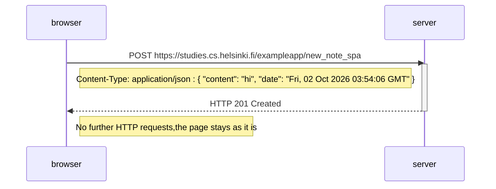

```mermaid
sequenceDiagram
    participant browser
    participant server

    browser->>server: POST https://studies.cs.helsinki.fi/exampleapp/new_note_spa
    activate server
    Note right of browser: Content-Type: application/json : { "content": "hi", "date": "Fri, 02 Oct 2026 03:54:06 GMT" }
    server-->>browser: HTTP 201 Created
    deactivate server

    
    Note right of browser: No further HTTP requests,the page stays as it is
```
